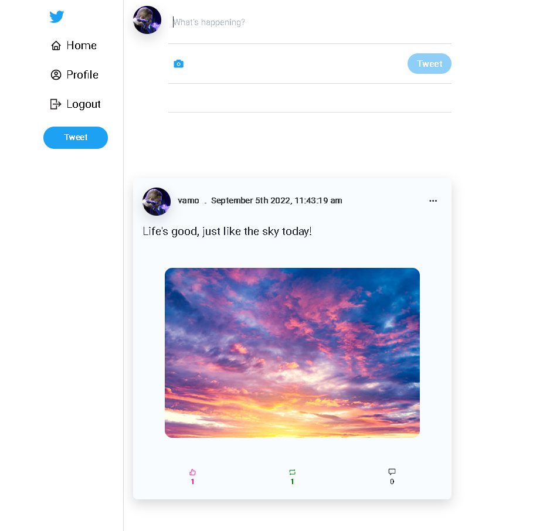

# MERN-Twitter-clone

Twitter clone made using MERN Stack.



## Features

- Sign up/ Sign in via JWT Token
- Customize account
- Tweet
- Comment
- Retweet
- Follow user
- Like tweets and comments
- Edit tweets and comments
- Delete tweets and comments

## Contribute

### Prerequisites

- node
- npm
- mongodb

1. Fork this repository
2. Clone this repository
3. Install server dependencies

```
$ cd server
$ npm install
```

4. Install client dependencies

```
$ cd client
$ npm install
```

### Run the app

1. Start mongodb locally

```
$ mongod
```

2. Start the server

```
$ cd server
$ nodemon server.js
```

3. Start the client

```
$ cd client
$ npm start
```

## License

This project is made available under the MIT License.
